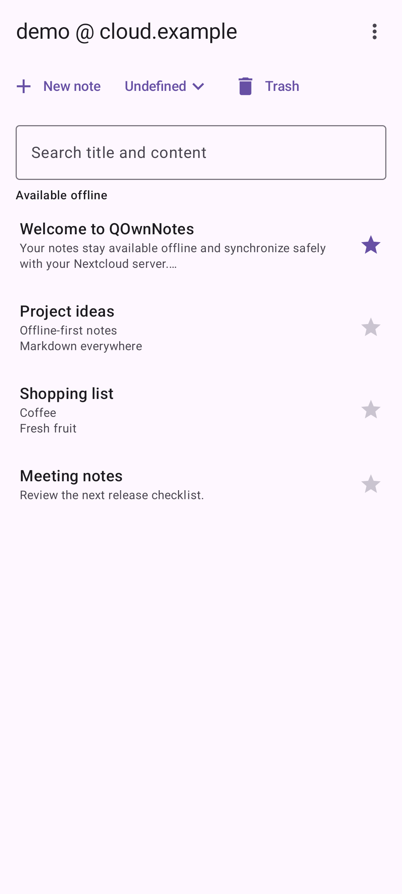
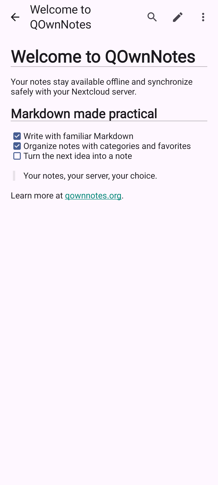
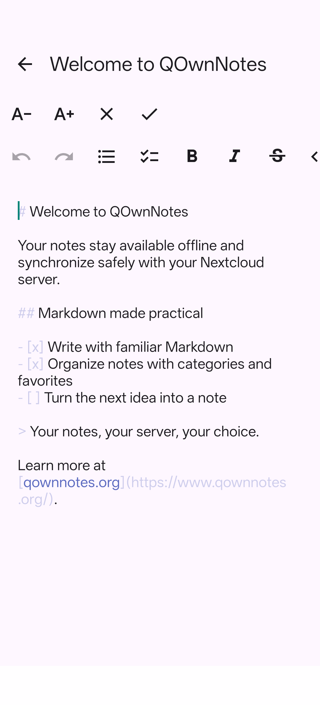

# QOwnNotes Mobile

QOwnNotes Mobile is an Android-first, offline-capable Markdown notes application. It preserves key
QOwnNotes behavior while synchronizing through the Nextcloud Notes API.

QOwnNotes Mobile is free software licensed under the
[GNU General Public License version 3 only](LICENSE). See the [privacy policy](PRIVACY.md) for how
local, Nextcloud, and remote-image data are handled.

### Obtainium

[](https://apps.obtainium.imranr.dev/redirect?r=obtainium://app/%7B%22id%22%3A%22org.qownnotes.mobile%22%2C%22url%22%3A%22https%3A%2F%2Fgithub.com%2Fqownnotes%2Fqownnotes-android%22%2C%22author%22%3A%22qownnotes%22%2C%22name%22%3A%22QOwnNotes%22%7D)

## Features

- Import one or more accounts from the Nextcloud Files Android app through Single Sign-On.
- Read, search, create, rename, edit, and delete notes while keeping Room as the offline source of
  truth.
- Synchronize with Nextcloud Notes API 1.2 or newer using incremental pulls, ETags, conflict-safe
  updates, and durable pending changes.
- Long-press notes to select several and move them to the Nextcloud trash bin together.
- Browse and restore server note versions and remotely trashed notes when the Nextcloud
  QOwnNotesAPI app is installed.
- Favorite notes with a star and keep them above other notes, including while offline.
- Filter notes by Nextcloud category, with per-account selections that remain available offline.
- Create a note from text shared by another Android application.
- Render CommonMark and GitHub Flavored Markdown, QOwnNotes task states, wiki links, legacy
  `note://` links, tables, fenced code, and safe remote images.
- Edit highlighted Markdown source with formatting actions, undo and redo, cursor preservation, and
  local draft persistence.
- Find text inside an open note, select and copy rendered text, and adjust the note text size.
- Detect read-only and QOwnNotes-encrypted notes and fail closed for unsafe HTML, links, images, and
  filesystem access.
- Use light and dark themes on Android 9 and newer.

The production application is named **QOwnNotes** and uses `org.qownnotes.mobile`. Development
builds are named **QOwnNotes Dev** and use `org.qownnotes.mobile.dev`, so both can be installed on
the same device. See [`CHANGELOG.md`](CHANGELOG.md) for release details.

## Screenshots

| Note list | Note view | Note edit |
| --- | --- | --- |
|  |  |  |

## Nextcloud Account Setup

Install the Nextcloud Files Android app, sign in to the desired server there,
then choose **Add Nextcloud account** in QOwnNotes Mobile. The app requires the
Nextcloud Notes server app with Notes API 1.2 or newer. Downloaded notes and
account metadata remain available offline; credentials stay in Nextcloud's SSO
integration and are not copied into the QOwnNotes database.

Use **Remove** in an account's note list to delete that account reference, its
synchronization history, and its cached notes from QOwnNotes Mobile. This does
not remove the account from Nextcloud Files or delete notes from the server.

Use **New** to create a QOwnNotes-compatible note or **Edit** while viewing a
writable note. Drafts are stored locally first and synchronized through the
Nextcloud Notes API; updates use the last known ETag to avoid blindly
overwriting a concurrent server edit.

### Editing Offline

Editing does not wait for Nextcloud. Changes are cached immediately while the app is running and
written to Room after a 500 ms pause, at least every five seconds during continuous typing, when
the editor loses focus, when editing finishes, or when the screen stops. A persisted edit remains
visible after restarting the app and stays queued if synchronization cannot reach the server. A
later edit, manual refresh, or return to the note list tries synchronization again.

Updates use the last known ETag. If the server copy changed in the meantime, the app keeps the
local text and marks the note as conflicted instead of overwriting the server. Open the conflict in
the note view and choose **Resolve conflict** to load the server version or first preserve the local
version as a new note. If the server cannot be reached, the local conflict remains untouched.
Durable background retry is not implemented yet. Because the live draft cache is in memory, an
abrupt process kill can lose only the characters entered since the latest idle or periodic Room
checkpoint.

## NixOS Recipes

### Enter The Development Environment

```sh
devenv shell
```

The first invocation downloads JDK 17, the Android SDK, build tools, platform

List the available recipes:

```sh
just
```

### Build The Development APK

```sh
just build-dev
```

`just build` is an alias for `just build-dev`. Android's standard local debug key signs the APK, so
this build does not require signing secrets.

The APK is written to:

```text
app/build/outputs/apk/debug/app-debug.apk
```

### Run On The Emulator

Create the project-local emulator once:

```sh
just create-avd
```

Start it in one `devenv shell`:

```sh
just start-emulator
```

In another `devenv shell`, install and launch the development app. The recipe waits until
Android's package manager is ready:

```sh
just deploy-dev
```

`just run` is an alias for `just deploy-dev`.

### Run On A Physical Android Device

Enable ADB access in the NixOS configuration and rebuild the system:

```nix
{
  programs.adb.enable = true;
  users.users.<username>.extraGroups = [ "adbusers" ];
}
```

Enable USB debugging on the device, connect it, accept the authorization
prompt, and verify the connection:

```sh
adb devices
```

Install and launch the development app:

```sh
just deploy-dev
```

After configuring the release signing variables described below, build and deploy the production
application over USB with:

```sh
just build-release
just deploy-release
```

### Run JVM Tests

```sh
just test
```

### Format Sources

```sh
just format
just format-check
```

### Check Dependency Licenses

```sh
just license-check
```

### Run Android Device Tests

With an emulator or physical device running:

```sh
just device-test
```

CI runs the same instrumentation suite on an API 36 emulator. Real Nextcloud
SSO interoperability remains a manual test because it requires an installed
and authenticated Nextcloud Files app.

### Run All Host-Side Checks

```sh
just check
```

### Build Signed Development And Release Variants

Routine development builds and deployments use Android's standard local debug key and do not access
Vaultwarden. Shared-key development builds and release builds retrieve signing files from a private
Vaultwarden instance. Create one item for each signing identity with these attachments:

```text
Development item:
qownnotes-development.jks
qownnotes-development.env

Release item:
qownnotes-release.jks
qownnotes-release.env
```

The development dotenv attachment must contain:

```dotenv
ANDROID_DEV_KEYSTORE_PASSWORD=...
ANDROID_DEV_KEY_ALIAS=...
ANDROID_DEV_KEY_PASSWORD=...
```

The release dotenv attachment must contain:

```dotenv
ANDROID_KEYSTORE_PASSWORD=...
ANDROID_KEY_ALIAS=...
ANDROID_KEY_PASSWORD=...
```

Configure the Bitwarden CLI for Vaultwarden and log in once:

```sh
bw logout
bw config server https://vaultwarden.example.com
bw login
just build-dev-signed
just deploy-dev-signed
just build-release
just deploy-release
just release
```

Use the shared-key development recipes only when installing over a development APK signed by CI or
another machine with that key. Switching an existing installation between the shared key and the
standard local debug key requires uninstalling it first, which clears that development app's data.

When the vault is locked, a signing recipe runs `bw unlock --raw` and prompts for the master
password itself. The resulting `BW_SESSION` exists only inside the wrapper, so it does not need to
be exported manually or stored in shell configuration. An already exported `BW_SESSION` is still
accepted for automation.

The public `devenv.nix` configuration sets `VAULTWARDEN_DEV_SIGNING_ITEM` and
`VAULTWARDEN_SIGNING_ITEM` to the item names above. The variables may instead contain item UUIDs and
may name the same item when all four attachments are stored together. Attachment names can be
overridden locally:

```text
VAULTWARDEN_DEV_KEYSTORE_ATTACHMENT
VAULTWARDEN_DEV_SIGNING_ENV_ATTACHMENT
VAULTWARDEN_KEYSTORE_ATTACHMENT
VAULTWARDEN_SIGNING_ENV_ATTACHMENT
```

The signing wrapper downloads the selected attachments into a private temporary directory, uses
the matching SecretSpec profile to validate and inject the dotenv values, sets the corresponding
keystore path, and removes both files when Gradle exits. It never sources the downloaded dotenv file
as shell code, and Gradle does not inherit the Vaultwarden session or item configuration.

The reproducible `devenv` shell provides `bw`, `jq`, and `secretspec`. Outside that shell, install
the Bitwarden Password Manager CLI, `jq`, and SecretSpec separately. These tools are not needed for
routine development recipes. GitHub Actions continues using its existing `ANDROID_DEV_*` and
`ANDROID_*` repository secrets. When either complete signing environment is already present, the
wrapper skips Vaultwarden and SecretSpec.

The signed outputs are written to:

```text
app/build/outputs/apk/debug/app-debug.apk
app/build/outputs/apk/release/app-release.apk
app/build/outputs/bundle/release/app-release.aab
```

CI runs checks and uploads a debug APK for every pushed branch except `release`, and for pull
requests. A push to the `release` branch instead runs the dedicated release workflow, which reads
the committed version, runs the checks, builds signed packages, extracts that version's section
from `CHANGELOG.md`, and publishes an immutable GitHub release tagged `v<version>`. Before pushing
to the release branch, increment both values in `version.properties` and add the matching changelog
section. Follow the complete preparation, publication, verification, and F-Droid checklist in
[`docs/releasing.md`](docs/releasing.md). Configure the following GitHub Actions repository secrets:

```text
ANDROID_KEYSTORE_BASE64
ANDROID_KEYSTORE_PASSWORD
ANDROID_KEY_ALIAS
ANDROID_KEY_PASSWORD
```

If QOwnNotes Mobile has already been distributed, use its existing release or upload key. Android
will not accept updates signed by a replacement key. For a first release, create and configure a
key from the repository root with:

```sh
mkdir -p .signing
keytool -genkeypair \
  -keystore .signing/qownnotes-release.jks \
  -storetype PKCS12 \
  -alias qownnotes-release \
  -keyalg RSA \
  -keysize 4096 \
  -validity 10000
base64 -w 0 .signing/qownnotes-release.jks | gh secret set ANDROID_KEYSTORE_BASE64
printf '%s' 'qownnotes-release' | gh secret set ANDROID_KEY_ALIAS
gh secret set ANDROID_KEYSTORE_PASSWORD
gh secret set ANDROID_KEY_PASSWORD
```

The final two commands prompt without putting the passwords in shell history. PKCS12 normally uses
the same password for the keystore and key. Store the `.jks` file and password in a durable password
manager backup; losing them can prevent future application updates.

Pushes to `main` also replace the GitHub prerelease tagged `continuous` with a signed **QOwnNotes
Dev** APK and its SHA-256 checksum. Use a separate development key so publishing continuous builds
does not expose the stable release key to the `main` workflow. Configure these additional secrets:

```text
ANDROID_DEV_KEYSTORE_BASE64
ANDROID_DEV_KEYSTORE_PASSWORD
ANDROID_DEV_KEY_ALIAS
ANDROID_DEV_KEY_PASSWORD
```

Create and configure a development key from the repository root with `keytool` and the GitHub CLI:

```sh
mkdir -p .signing
keytool -genkeypair \
  -keystore .signing/qownnotes-development.jks \
  -storetype PKCS12 \
  -alias qownnotes-development \
  -keyalg RSA \
  -keysize 4096 \
  -validity 10000
base64 -w 0 .signing/qownnotes-development.jks | gh secret set ANDROID_DEV_KEYSTORE_BASE64
printf '%s' 'qownnotes-development' | gh secret set ANDROID_DEV_KEY_ALIAS
gh secret set ANDROID_DEV_KEYSTORE_PASSWORD
gh secret set ANDROID_DEV_KEY_PASSWORD
```

The final two commands prompt for the passwords without putting them in shell history. PKCS12
normally uses the same password for the keystore and key, so enter the password chosen by `keytool`
for both secrets. Keep the `.jks` file and its password in a secure backup: every continuous APK
must use the same key for Android to accept it as an update. The `.signing/` directory is ignored by
Git.

The Base64 variables contain the binary keystores in a text form GitHub Actions can store. The
keystore-password, alias, and key-password variables select and unlock the private key inside each
keystore. `ANDROID_KEYSTORE_PATH` and `ANDROID_DEV_KEYSTORE_PATH` are local or temporary file paths,
not repository secrets. `ANDROID_VERSION_CODE` is also not a secret: continuous CI sets it to the
current Unix timestamp so every development build has a higher Android version code.

### F-Droid Releases

Build the unsigned release APK expected by F-Droid without loading any signing credentials:

```sh
just build-fdroid
```

The stable release workflow runs this unsigned build before creating the signed GitHub release and
its immutable `v<version>` tag. F-Droid does not accept direct deployment from the upstream GitHub
workflow: its own infrastructure checks out that tag, rebuilds the APK from source, signs it, and
publishes it. After the initial `fdroiddata` submission is accepted, F-Droid's tag-based update
check can discover later release tags automatically.

Each stable release must include a store changelog at
`fastlane/metadata/android/en-US/changelogs/<versionCode>.txt`. The release workflow verifies that
the file exists and is no longer than F-Droid's 500-character limit. Store descriptions and images
are maintained under `fastlane/metadata/android/en-US/`.

Generate deterministic list, rendered-note, and editor screenshots from fixed test data on a
connected emulator or device with:

```sh
just update-fdroid-screenshots
```

The focused instrumentation test captures only the application window, hides the keyboard, and
writes no real account or server data. Device-test CI also captures the images and uploads them with
the Android test artifacts for review. Run the update recipe before a release when the visible UI
has changed, review the three PNGs, and commit them with the release.

The initial submission still requires a one-time merge request to the
[`fdroiddata`](https://gitlab.com/fdroid/fdroiddata) repository for
`metadata/org.qownnotes.mobile.yml`. Use `GPL-3.0-only` as the license, the HTTPS source repository
URL, a full commit hash for the release tag, `gradle: yes`, and these update settings:

```yaml
AutoUpdateMode: Version
UpdateCheckMode: Tags ^v[0-9].*$
UpdateCheckData: version.properties|VERSION_CODE=(\d+)|.|VERSION_NAME=(.*)
```

Normal F-Droid builds use an F-Droid signing key, so users cannot switch between GitHub and F-Droid
APK installations without reinstalling. Supporting the same developer signature on both channels
requires arranging a reproducible-build submission with F-Droid before its first publication. The
release workflow uses `apksigcopier` to ensure the signed GitHub APK matches its unsigned source
build apart from the signature. A reproducible F-Droid submission must additionally provide the
GitHub APK URL through `Binaries`, pin the release signing certificate with
`AllowedAPKSigningKeys`, and pass the same comparison in F-Droid's independent build environment.
The current stable signing certificate SHA-256 fingerprint is
`c1e358ca679e6198d4116eca81456cf9527f44942244c033967b5e637db187aa`, and the binary URL pattern is:

```yaml
Binaries: https://github.com/qownnotes/qownnotes-android/releases/download/v%v/QOwnNotes-Mobile-%v.apk
AllowedAPKSigningKeys: c1e358ca679e6198d4116eca81456cf9527f44942244c033967b5e637db187aa
```

### Clean Build Outputs

```sh
just clean
```
